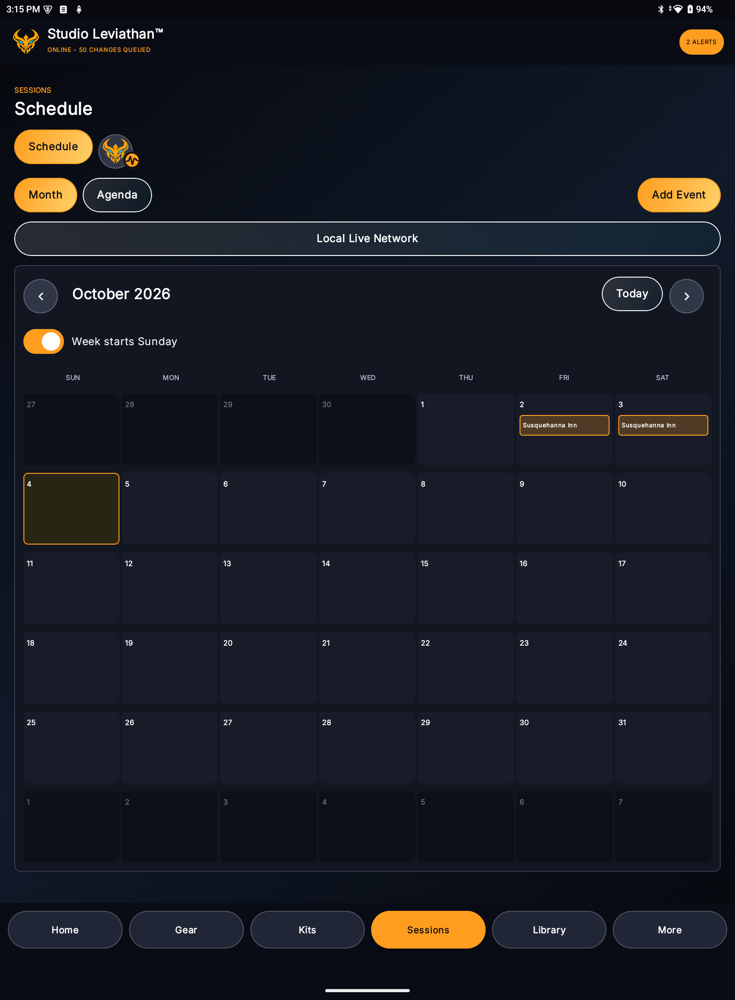

# Calendar and Events

## Open the calendar

Open **Sessions > Schedule**. Choose:

- **Month** for a visual calendar; or
- **Agenda** for a filtered chronological list with full event actions.

The selected month has previous, next, and **Today** controls. Select any day cell to begin a new event on that date. Select an existing event marker to open its details.

## Choose the first day of the week

Use **Week starts Sunday** in Month view. Turn it off to begin the week on Monday. This is a device display preference; it does not alter event dates or other members' preferences.

## Create an event

1. Select a day or choose **Add Event**.
2. Choose the event type: Performance, Rehearsal, Studio Session, or Other.
3. Enter a clear title.
4. Set the start date and, unless all-day, the start time.
5. Set the end date and end time. Multi-day work must use the true final date, not a note describing the duration.
6. Turn on **All-day event** when clock times are not meaningful.
7. Select a calendar color.
8. Choose Normal, Important, or Critical importance.
9. Turn on **Private event** when the event should be visibly designated as private.
10. Add location, venue, set list, group, people, kits, notes, and reminder information as appropriate.
11. Save.

### Private designation

Private is a calendar classification, not a replacement for workspace permissions. Everyone who already has permission to receive the event may still receive it. Use workspace roles, membership, and sharing scopes to control actual access.

### Color and importance

Color is a visual grouping aid. Use a consistent workspace convention, for example performance, rehearsal, recording, travel, and personal preparation. Importance communicates urgency and can influence how the event is emphasized; it does not automatically notify more people.

## Use reusable records

Whenever possible, select an existing venue, group, contact, set list, or kit rather than typing the same information into notes. Reusable records support consistent directions, communication, offline preparation, reporting, and future calendar integrations.

The event can still contain one-off room, stage, entrance, call-time, or location details without changing the reusable venue.

## Open event actions

An event can provide actions for:

- reviewing full details;
- opening directions in a compatible map application;
- editing or copying the event;
- opening the event's set list in Leviathan Live;
- reviewing and contacting people;
- creating or sharing an `.ics` calendar file;
- printing/sharing through supported Android applications;
- deleting the event when the role permits.

Actions can be unavailable when the event lacks the required data or the current member lacks permission.

## Send event information

Open the event's People action to resolve direct participants, selected bands/groups, and venue contacts.

Recipient scopes can include:

- people directly assigned to the event;
- members of an assigned band/group;
- venue contacts;
- everyone resolved from the event;
- a custom selection.

Each person can be included or excluded with the slider beside that person. Choose email or text only when the corresponding contact method exists. Android opens the appropriate messaging application so the user can review and send the message.

## Share an ICS calendar event

The `.ics` action is available from the actual event as well as contextual schedule/export actions.

1. Open the event.
2. Choose the calendar/share action.
3. Select the intended recipient scope.
4. Include or exclude individual recipients with sliders.
5. Choose email or text where available.
6. Review the generated message and attachment in the selected Android application.
7. Send.

The calendar file includes supported start/end information, title, location, and event details. The receiving calendar application controls how updates, duplicates, reminders, and timezone presentation are handled.

Text messaging support depends on the selected messaging application and its ability to handle an attached/shared calendar file. When an application cannot attach the file to SMS/MMS/RCS, use email or the Android share sheet.

## Reminders

Event reminders use the same Studio Leviathan reminder architecture as other scheduled work. Configure whether a reminder is enabled and its lead time. Delivery still depends on account notification settings, Android notification permission, synchronization, quiet hours, and server availability.

An `.ics` calendar reminder and a Studio Leviathan reminder are separate. Importing an event into another calendar does not disable Studio Leviathan reminders.

## Offline behavior

Synchronized events remain visible offline. New or edited events are queued and upload later. Calendar-file creation can use local event data, but sending through email or text normally requires connectivity from the chosen messaging application.

Before relying on a newly assigned set list or participant relationship offline, synchronize after saving it on the web or another device.
