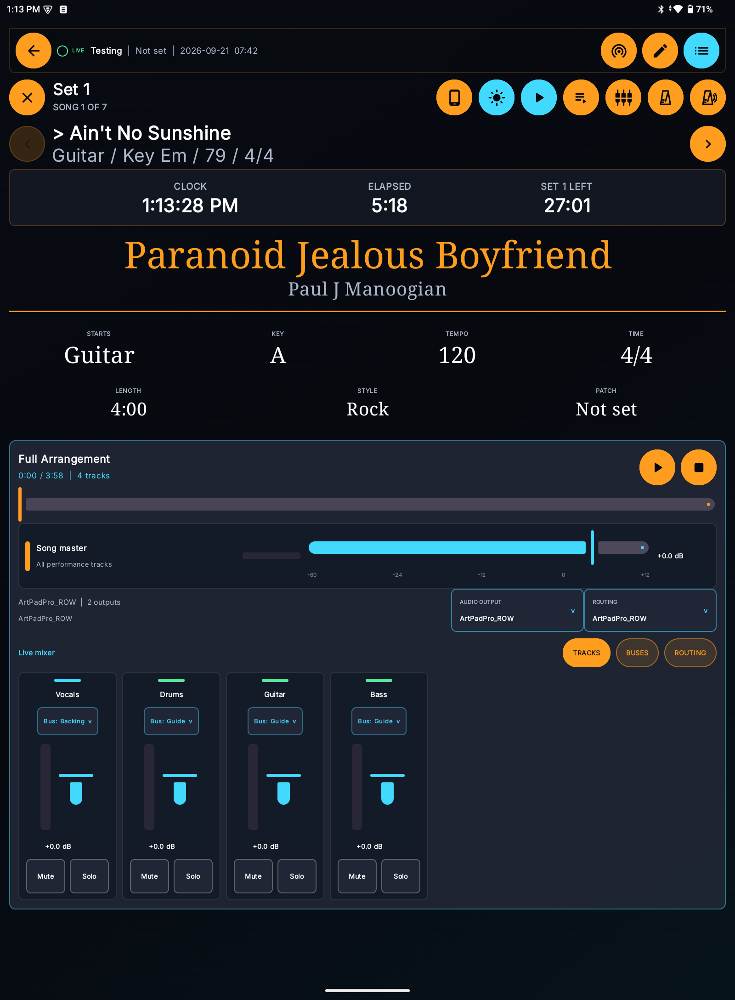

# Leviathan Live

Leviathan Live is the stage-focused set-list and performance-material environment. It is designed for large touch targets, fast song movement, offline material, timing, playback, hardware control, and coordinated devices.

## Prepare a show

Do this before arriving at the stage:

1. Confirm the event uses the intended set list.
2. Review the song order, named sets, medleys, manual entries, and per-entry notes.
3. Confirm every song has the correct key, tempo, time signature, duration, starts cue, patch, and preferred material.
4. Select the intended attachment for set-list entries where several charts or lyric versions exist.
5. Synchronize the Android device.
6. Open every critical attachment and playback file.
7. Test audio routing with the actual interface and cabling.
8. Test the Bluetooth pedal, MIDI output, metronome, and Wear companion.
9. Rehearse Local Live when multiple devices will participate.
10. Connect device power and disable unrelated interruptions according to venue policy.

## Open Leviathan Live

From an event, choose its Leviathan Live action. The event supplies the set list, location, date/time, and related performance context.

Leviathan Live provides two primary views:

- **List view** - a compact, scannable running order optimized for selecting and reviewing songs.
- **Chart view** - the current-song performance screen with material, song facts, timing, playback, markers, and controls.

The list/chart control is a single toggle. Its icon indicates the view you will open next.

## Header controls

Depending on width and configuration, the header provides the following buttons. Cyan means selected or active, orange means available, and a dimmed button is unavailable in the current position or song.

| Appearance | Button | Meaning |
| --- | --- | --- |
| Left arrow | **Back** | Leave Leviathan Live and return to Schedule or the event. |
| Broadcast/rings | **Live network** | Open Local Live status, hosting, or joining. This reports synchronization, not audio output. |
| Pencil | **Edit** | Open live set-list editing when the member has permission. |
| List lines | **List / Chart** | Toggle the running order and current-song performance view. |
| X | **Return to set list** | Close the current chart and show the running order. |
| Phone/window | **Phone format** | Use compact responsive arrangement. It is automatic on a narrow phone. |
| Sun or moon | **Appearance** | Change performance-material presentation for stage lighting. |
| Play or disabled-play symbol | **Performance audio** | Enable or disable song playback tools. It does not immediately start the arrangement. |
| Play with list lines | **Autoplay** | Arm automatic playback after later song changes. The first song still waits for Play. |
| Sliders | **Live hardware** | Open audio output, routing-profile, MIDI, and show-control choices for this Android device. |
| Metronome | **Metronome** | Start or stop the local metronome at the song tempo. |
| Muted metronome | **Metronome sound** | Mute or restore the click without stopping metronome timing. |
| Left chevron | **Previous song** | Move to the previous entry. Disabled at the beginning of the set list. |
| Right chevron | **Next song** | Move to the next entry. Bluetooth page-turn commands use the same action. |

On a phone, controls become a horizontally scrollable tool row and current-song information is moved earlier so the performer does not lose it below a large empty performance area. On a narrow screen, phone format is automatic.

## Current and next song

The current song uses the stronger amber/orange emphasis. The next-song information is intentionally quieter. Previous and next buttons change the selected song. Manual entries remain in the running order but may not have full song metadata or performance material.

The displayed position reflects the complete performance order. Songs inside a named medley or tribute group preserve their grouping and internal position.

## Performance material

Chart view can display locally available:

- rendered lyrics and ChordPro;
- synchronized lyric lines;
- PDFs with page navigation;
- images;
- linked or cached charts, tabs, and sheet music;
- supported control and playback assets.

### Night view

The sun/moon button changes document presentation for stage lighting. It is a button rather than a slider. Use it when a white PDF or image is too bright. The result depends on material type; transformed document color is a viewing aid and does not alter the source file.

### Phone/standard format

The phone/window icon switches the layout density on a larger device. A genuinely narrow phone uses phone format automatically. This setting changes arrangement, not the underlying set list or selected material.

## Timed song guide and section markers

When a song contains timed sections, Chart view shows:

- current playback time;
- expected song duration;
- a progress control;
- compact play/pause and stop controls;
- color-coded section strips with section names and start times.

Selecting a section requests its time position and scrolls matching material toward the start of that section. The scroll destination leaves useful context near the top instead of placing the heading under fixed controls.

Timed sections can come from canonical Song Sections and timed ChordPro directives. Keep section names and times consistent so web and Android render the same structure.

## Metronome and count-in

The native metronome runs locally through Android audio. It does not need internet.

Settings can include:

- start automatically for a song;
- continue visual pulse while muted;
- emphasize the first beat;
- choose a sound profile;
- apply the song tempo and time signature;
- use a configured count-in before the song timeline begins.

The metronome icon represents the metronome directly. The mute control also uses metronome-specific visual language so it cannot be confused with general media volume.

## Playback and autoplay

Playback and autoplay are separate decisions:

- **Playback enabled** permits the selected song audio to play.
- **Autoplay armed** allows moving to a later song to start its selected audio automatically.

The first song always waits for a deliberate start. Autoplay does nothing while playback is disabled. A song with one eligible playback track can use it automatically; when several are available, select the intended one in the set list.

The playback clock drives timed sections, lyric timing, and cue alignment. Stop resets the current playback position.

## Multitrack playback

Multitrack songs can contain stems assigned to virtual buses. The bus model separates musical intent from specific hardware:

- a stem points to a virtual bus such as Main Mix, Click, Guide, or Backing;
- a routing profile maps each virtual bus to physical outputs on an audio device;
- mono/stereo is a single toggle-style control;
- each route has an independent MUTE button;
- the output selector only offers valid channels for the detected/configured hardware capacity.

### Mixer at a glance

This tablet example shows the whole performance context rather than an isolated control. Song navigation remains available above the mixer. The arrangement uses four tracks titled **Vocals**, **Drums**, **Guitar**, and **Bass**. These short labels come from each file's **Stem Role**, not its uploaded filename. The original filename and file identity remain unchanged.

### Arrangement controls

| Control | Meaning | Result |
| --- | --- | --- |
| **Full Arrangement** | The active multitrack arrangement. | Shows elapsed time, total duration, and synchronized track count. |
| **Play / Pause** | Start or pause all stems. | Pause preserves position; Play resumes from that position. |
| **Stop** | Stop every stem. | Returns the shared arrangement clock to the beginning. |
| **Progress bar** | Display or change position. | Seeking moves all stems, timed sections, lyrics, and armed cues together. |
| **Song master** | Final arrangement-level gain. | Applies after individual track and bus gain. |
| **Song master meter** | Measured combined output activity. | A moving meter indicates in-app signal, not successful external cabling. |
| **Audio Output** | Device-local playback destination. | Select the connected internal, USB, or other Android output. |
| **Routing** | Active compatible routing profile. | Maps logical buses to the numbered outputs exposed by the selected device. |

### Mixer views

| View | What it shows | Use it for |
| --- | --- | --- |
| **Tracks** | Every stem in the active arrangement. | Individual gain, signal, bus assignment, Mute, and Solo. |
| **Buses** | Every available virtual bus, including an unused bus. | Shared gain and Mute for Main Mix, Click, Guide, Backing, or a custom destination. |
| **Routing** | The active hardware-routing choices. | Confirm or change the profile used by this Android device. |

### Track strip controls

Each track strip has the same reading order:

1. **Color rail** - matches the assigned logical bus.
2. **Stem Role title** - a short functional name such as Vocals, Drums, Bass, Click, or Guide. Legacy tracks without a role temporarily fall back to their display name.
3. **Bus button** - opens a finger-sized menu of available buses. Choosing a bus moves this stem to that logical destination; it does not rename or duplicate the file.
4. **Signal meter** - shows measured activity. It is not a gain control.
5. **Gain fader** - adjusts this track from -60 dB to +12 dB. 0.0 dB is unity gain.
6. **Mute button** - silences this track while preserving gain and routing. Active Mute is orange.
7. **Solo button** - isolates one or more selected tracks. Active Solo is cyan.

### Bus strip controls

A bus strip represents a destination group rather than a source file. It shows the bus name, profile output such as **Output 3** or **Outputs 1-2**, measured signal, gain, and Mute. Bus Mute affects every track assigned to that bus. Buses do not have Solo because Solo is a source-track inspection control.

### Four-output example

| Stem Role | Logical bus | Profile route | Typical destination |
| --- | --- | --- | --- |
| Drums, Guitar, Bass, Vocals | Main Mix | Outputs 1-2, Stereo | Front-of-house backing mix |
| Click | Click | Output 3, Mono | Drummer or in-ear mixer |
| Guide | Guide | Output 4, Mono | Band monitor or in-ear mixer |

The tracks can change from song to song while the logical buses and hardware profile remain stable. On a stereo-only device, use stereo fallback and verify whether private Click or Guide material should be muted or combined.

### Gain, meter, and silence troubleshooting

Gain settings add across the track, bus, Song master, and final device-volume stages. Avoid large positive gain at several stages. If a track is silent, check in this order:

1. Arrangement playback is running and the progress clock is moving.
2. The track is not muted and is not excluded by another track's Solo state.
3. Track gain is above -60 dB and its meter shows activity during known audio.
4. The assigned bus is not muted and its gain is audible.
5. The routing profile does not mute the route and maps it to a valid output.
6. The intended Audio Output and compatible Routing profile are selected.
7. The physical cable, receiving mixer channel, and downstream gain are correct.

A meter can remain idle when playback is stopped, the source contains silence, the channel is muted, or measurement is unavailable. Never treat meter movement alone as proof that the audience or monitor is receiving the intended signal.

### Detect hardware

Open Live hardware/audio routing and choose detection. Android reports compatible output devices visible to the platform. Some USB interfaces require an OTG-capable cable, device permission, external power, or a vendor-supported Android mode.

Detection reports what Android exposes. It cannot invent separate physical outputs when the Android driver presents only a stereo pair.

### Create a routing profile

1. Connect the intended audio interface.
2. Open the audio-routing profile area.
3. Choose **Use device** when detection identifies the hardware, or enter a descriptive profile name and confirmed output count.
4. Mark the profile preferred when it should win for compatible hardware.
5. For each bus, choose a valid output or output pair.
6. Toggle MONO/STEREO as required.
7. Mute any bus that should be silent in this profile.
8. Save the profile.

Removing a routing profile removes only that hardware mapping. It does not delete buses or audio files.

### Performance check

The suggested bus count is a planning aid, not a guarantee. Device throughput depends on sample rate, channel count, USB implementation, buffer behavior, concurrent processing, and other applications. Run the available performance check with the actual interface, files, and cabling, then rehearse for longer than the longest expected set.

## Bluetooth pedal controls

Android handles configured pedal keys locally while Leviathan Live is active. Supported actions can include:

- previous/next song;
- previous/next page;
- scroll up/down by the configured amount;
- toggle List/Chart view;
- playback and autoplay controls;
- play/pause or stop current audio;
- start/stop or mute the metronome.

Configure the canonical 2-, 4-, or 6-button mapping in the web application. Synchronize afterward. If a pedal moves keyboard focus instead of the performance, verify its operating mode and exact key codes.

## MIDI and control files

The live hardware area exposes supported MIDI destinations. A song can carry MIDI or DMX-MIDI control material. Test the complete receiving chain before performance; Android can report a connected destination while downstream hardware, channel, program, or cabling is still wrong.

## Local Live

Local Live coordinates devices on shared Wi-Fi when the internet is unavailable.

### Host

1. Open **Sessions > Local Live Network** or the Live header control.
2. Select the event and choose Host.
3. Share the temporary join code with participating devices.
4. Keep the host device connected and powered.

The host is authoritative for the local workspace and keeps changes queued for later cloud synchronization.

### Join

1. Connect to the same Wi-Fi network.
2. Open Local Live.
3. Enter the host's current join code.
4. Confirm the event and set list received from the host.

Local Live is not a public-internet service and is not a substitute for cloud synchronization. Synchronize the host after internet service returns.

## Performance layout templates

Performance layouts are created and previewed with the visual editor in the canonical web application. Layouts define responsive sections and relative sizing for phone, tablet, and desktop formats. Android consumes the published layout and applies device-safe constraints.

If a custom template produces an unusable view, switch back to a supplied template on the web, publish it, and synchronize Android. Do not attempt to repair a layout during a live song unless a fallback is already visible.

## End of show

1. Stop playback and metronome.
2. Return to the set list and note any changes needed.
3. Record equipment issues through Gear maintenance notes.
4. Allow Crew's post-performance check-in when enabled.
5. Synchronize the host and participating devices on a dependable network.
6. Resolve conflicts before editing the same records again elsewhere.
