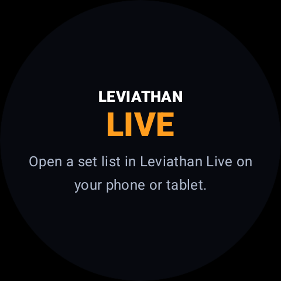

# Wear OS Companion

The Wear OS application is a non-standalone companion. The Android phone/tablet remains the performance authority, owns playback and synchronization, and must have Leviathan Live open.

## Requirements

- a supported Wear OS watch paired with the Android phone;
- Studio Leviathan installed from the corresponding Play testing/release channel;
- the Wear companion installed under the same Play listing;
- Bluetooth and required nearby-device services enabled;
- the phone/tablet signed into Studio Leviathan;
- an active Leviathan Live set list.

## Install

1. Install Studio Leviathan on the phone.
2. Open **Sessions > Leviathan Live > Settings > Wear OS**.
3. Review the reported connected watch and companion status.
4. If missing, select **Install on Watch**. Android opens the Studio Leviathan Play listing on the connected watch.
5. Complete installation on the watch.
6. Open the companion once, then open Leviathan Live on the phone/tablet.

## Connection states

- **LIVE** - the watch is receiving current Leviathan Live state.
- **CACHED** - the watch is temporarily disconnected but retains the last received state.
- The waiting screen instructs the user to open a set list in Leviathan Live when no active performance state is available.

The app can report the watch as connected before the companion capability is fully available. Allow installation and capability discovery time, then reopen the Wear panel.

## What the watch shows

When connected, the watch can show the active set/song context, current and next song information, set or medley position, and synchronized metronome state according to the available screen.

## Controls

Supported watch controls can include:

- previous song;
- next song;
- metronome start/stop;
- metronome mute/unmute;
- synchronized haptic beat feedback.

The phone acknowledges commands and prevents duplicate execution. Use the phone/tablet for editing, chart viewing, playback routing, Local Live administration, and any operation that requires more context.

## Haptic metronome

Haptics follow the performance authority's tempo and running state. Watch vibration settings, battery saver, accessibility options, and manufacturer behavior can change intensity or suppress vibration.

Test haptics during rehearsal. Do not assume a watch vibration is precise enough to replace monitored click audio for every performer.

## Troubleshooting

### Watch says to open a set list

Open Leviathan Live on the paired phone/tablet and select an active set list. Keep both applications foregrounded for the first connection.

### Companion not installed

Use **Install on Watch**, then confirm the same Google account can access the Play testing track on both devices.

### CACHED does not return to LIVE

1. Confirm Bluetooth connection in Android/Wear settings.
2. Reopen Studio Leviathan on the watch.
3. Return to Leviathan Live on the phone.
4. Review **Wear OS** settings for the connected node.
5. Restart Bluetooth or both devices only after preserving current performance state.

### Command does nothing

Confirm that Leviathan Live, not an editor or other screen, is active. Wait for LIVE status and press once. Repeated taps during reconnection can be ignored deliberately to prevent duplicate song movement.
